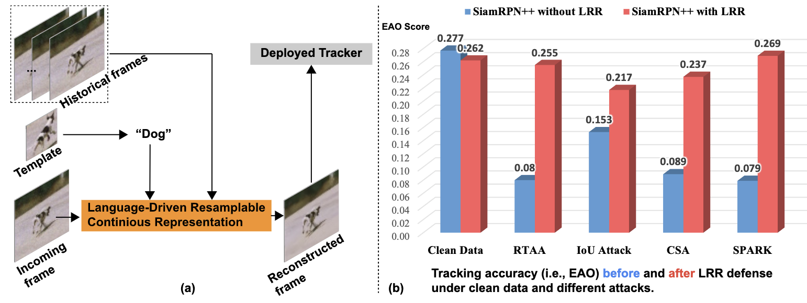

# robustOT

We build a benchmark to involve existing adversarial tracking attacks and defense methods and evaluate their performance, which could trick a series of novel works and push the progress to build a robust tracking system. This framework involves our recent tracking defense work published in ICLR 2024.




# Installation

`robustot` incorporates the modern Python typing system for static type checking, making it easier to work with our tracking interfaces. Moreover, it utilizes the latest stable version of PyTorch for powering its tracking platform.

### Requirements

-   Python version ≥ 3.10
-   Pytorch version ≥ 2.0.1

We recommend using `conda` to install the latest PyTorch:

```bash
conda install pytorch torchvision torchaudio pytorch-cuda=11.7 -c pytorch -c nvidia
```

Then, use `pip` to install the required packages:

```shell
pip install -r requirements/msot.txt

# dev only
pip install -r requirements/dev.txt
```

### Setup ENV

Set up environment variables and make sure `robustot` and its dependencies are accessible to Python.

```shell
source env.sh
```

## Gettings started

### Quick start

-   Testing

    We offer a unified interface for immediate testing on your configuration with any chosen tracker and processors. All available trackers are located in `$MSOT_ROOT/configs/tests`, and all processors are in `$ROBOT_ROOT/configs`.

    For instance, to start a test without any processors, utilize the following command:

    ```shell
    python $ROBOT_ROOT/scripts/test.py \
        -c $MSOT_ROOT/configs/tests/test_siamrpnpp_r50_otb.py \
        -d OTB100 \
        -o results

    ```

    Combining with arbitrary processors can be seamlessly achieved by passing the processor's config file at the test entry point. For example, to initiate a test with the CSA attack, use the command below:

    ```shell
    python $ROBOT_ROOT/scripts/test.py \
        -c $MSOT_ROOT/configs/tests/test_siamrpnpp_r50_otb.py \
        -d OTB100 \
        -p $ROBOT_ROOT/configs/builtin/crop.py \
        -p $ROBOT_ROOT/configs/atk/csa.py \
        -o results_csa
    ```

    For additional details, execute the following for a help message:

    ```shell
    python $ROBOT_ROOT/scripts/test.py --help
    ```

-   Evaluation

    Evaluation can be performed using the evaluation entry point:

    ```shell
    python $ROBOT_ROOT/scripts/eval.py -d OTB100 -p results

    # To display the help message
    python $ROBOT_ROOT/scripts/eval.py --help
    ```

### Processors


## Bibtex

```
@article{chen2024lrr,
  title={LRR: Language-Driven Resamplable Continuous Representation against Adversarial Tracking Attacks},
  author={Chen, Jianlang and Ren, Xuhong and Guo, Qing and Juefei-Xu, Felix and Lin, Di and Feng, Wei and Ma, Lei and Zhao, Jianjun},
  journal={ICLR},
  year={2024}
}
```
